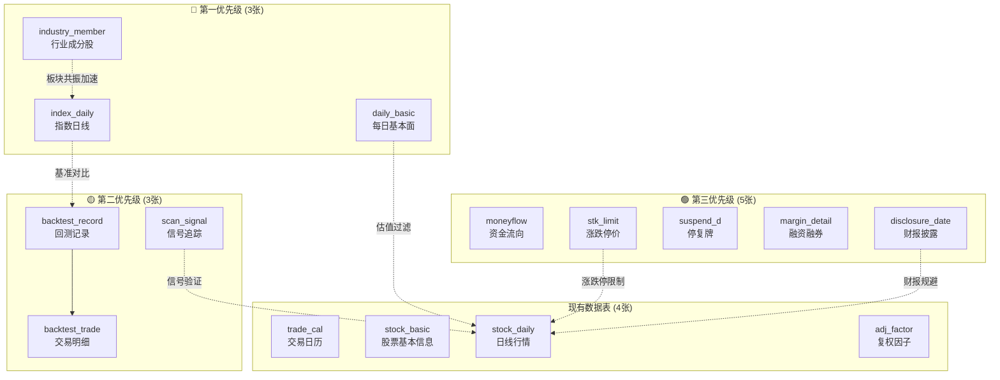

# 数据库补充数据表设计方案

> 基于现有 4 张表与策略代码需求缺口的分析

---

## 现状盘点

当前数据库仅有 **4 张表**，覆盖的是"最小可用"的行情数据：

| 现有表 | 数据来源 | 用途 |
|--------|---------|------|
| `trade_cal` | trade_cal | 交易日历，同步调度的基础依赖 |
| `stock_basic` | stock_basic | 股票元信息（行业、市场、上市状态） |
| `stock_daily` | daily | 日线行情（OHLCV + 涨跌幅） |
| `adj_factor` | adj_factor | 复权因子 |

**缺口分析**：对照代码中已引用或隐含需要的数据维度，以下功能目前靠"近似计算"或"直接缺失"：

| 代码位置 | 功能 | 当前方式 | 问题 |
|----------|------|---------|------|
| `VCPStrategy._check_buy` → 板块共振 | 行业整体强度 | 查 `stock_daily` 算全行业股票平均涨幅 | 每次查询全行业数千条记录，极慢且不准确 |
| `BacktestEngine` | 基准对比 | ❌ 不存在 | 无法评估策略是否跑赢大盘 |
| `MomentumStrategy` → 财报规避 | 财报发布日期 | 外部 `earnings_dates` 手动传入 | 无自动数据源 |
| 回测结果 | 历史回测记录 | 打印终端 / CSV 导出 | 无法对比历史回测版本 |
| 扫描器信号 | 信号追踪 | 打印终端 | 无法回看历史信号准确率 |

---

## 🔴 第一优先级 — 策略直接需要

### 1. `index_daily` — 指数日线行情

> **解决问题**：基准对比（策略 vs 沪深300）、板块共振（行业指数替代全行业股票平均）

| 字段 | 类型 | 说明 |
|------|------|------|
| `ts_code` ★ | String(12) | 指数代码，如 `000300.SH`（沪深300） |
| `trade_date` ★ | Date | 交易日期 |
| `open` | Numeric(12,4) | 开盘点位 |
| `high` | Numeric(12,4) | 最高点位 |
| `low` | Numeric(12,4) | 最低点位 |
| `close` | Numeric(12,4) | 收盘点位 |
| `pre_close` | Numeric(12,4) | 昨收点位 |
| `change` | Numeric(12,4) | 涨跌额 |
| `pct_chg` | Numeric(10,4) | 涨跌幅(%) |
| `vol` | Numeric(20,2) | 成交量(手) |
| `amount` | Numeric(20,4) | 成交额(千元) |

- **Tushare 接口**: `index_daily`
- **主键**: `(ts_code, trade_date)`
- **索引**: `ix_index_daily_trade_date` — 按日期查某日全部指数
- **数据量**: ~20 个常用指数 × 8000 交易日 ≈ 16 万行（极小）
- **同步策略**: 与 `stock_daily` 同步逻辑一致，逐日拉取

> [!NOTE]
> 当前 `manual_sync.py` 中的 `sync_index_data()` 将指数数据写入 `stock_daily` 表，这会导致个股和指数数据混在一起。独立建表更清晰。

**策略对接点**：
```python
# 回测报告中对比基准
benchmark_df = reader.get_index_daily("000300.SH", start, end)
excess_return = strategy_return - benchmark_return
```

---

### 2. `daily_basic` — 每日基本面指标

> **解决问题**：估值过滤（避免追高垃圾股）、换手率判断（量能真实性）、市值筛选

| 字段 | 类型 | 说明 |
|------|------|------|
| `ts_code` ★ | String(12) | TS 代码 |
| `trade_date` ★ | Date | 交易日期 |
| `turnover_rate` | Numeric(10,4) | 换手率(%) |
| `turnover_rate_f` | Numeric(10,4) | 换手率(自由流通股) |
| `volume_ratio` | Numeric(10,4) | 量比 |
| `pe` | Numeric(12,4) | 市盈率（总市值/净利润） |
| `pe_ttm` | Numeric(12,4) | 市盈率（TTM） |
| `pb` | Numeric(12,4) | 市净率 |
| `ps` | Numeric(12,4) | 市销率 |
| `ps_ttm` | Numeric(12,4) | 市销率（TTM） |
| `dv_ratio` | Numeric(10,4) | 股息率(%) |
| `dv_ttm` | Numeric(10,4) | 股息率（TTM） |
| `total_share` | Numeric(20,4) | 总股本（万股） |
| `float_share` | Numeric(20,4) | 流通股本（万股） |
| `free_share` | Numeric(20,4) | 自由流通股本（万股） |
| `total_mv` | Numeric(20,4) | 总市值（万元） |
| `circ_mv` | Numeric(20,4) | 流通市值（万元） |

- **Tushare 接口**: `daily_basic`
- **主键**: `(ts_code, trade_date)`
- **索引**: `ix_daily_basic_trade_date`
- **数据量**: ~5000 股 × 5000 交易日 ≈ 2500 万行（与 `stock_daily` 同量级）
- **积分要求**: 120 分（满足）

**策略对接点**：
```python
# VCP 策略增强：过滤小市值垃圾股
if row['total_mv'] < 500000:  # 总市值 < 50亿
    return False, "市值过小"

# 动量策略增强：换手率辅助判断量能真实性
if row['turnover_rate_f'] < 3.0:
    return False, "换手率不足，量能可能为对倒"
```

---

### 3. `industry_member` — 行业成分股映射

> **解决问题**：板块共振查询效率。当前 VCP 每次共振检查都要查 `stock_basic` 获取同行业所有股票，再逐一查 `stock_daily`，非常慢。

| 字段 | 类型 | 说明 |
|------|------|------|
| `index_code` ★ | String(20) | 行业指数代码 |
| `index_name` | String(50) | 行业指数名称 |
| `ts_code` ★ | String(12) | 成分股 TS 代码 |
| `con_name` | String(50) | 成分股名称 |
| `in_date` | Date | 纳入日期 |
| `out_date` | Date | 剔除日期 |
| `is_new` | String(1) | 是否最新 Y/N |

- **Tushare 接口**: `index_member_all` 或 `ths_member`（同花顺行业）
- **主键**: `(index_code, ts_code)`
- **数据量**: ~100 个行业 × ~50 成分股 ≈ 5000 行（极小）

**策略对接点**：
```python
# 替代现有的低效查询
# 现在: SELECT * FROM stock_basic WHERE industry = '有色金属'  (~200条)
#       → 逐条查 stock_daily  (~200次查询)
# 优化后: 直接查行业指数日线 (~1次查询)
sector_df = reader.get_index_daily("884193.TI", trade_date)  # 有色金属指数
```

---

## 🟡 第二优先级 — 回测评估需要

### 4. `backtest_record` — 回测记录表

> **解决问题**：持久化回测结果，支持历史回测对比和参数优化追踪

| 字段 | 类型 | 说明 |
|------|------|------|
| `id` ★ | Serial/UUID | 主键 |
| `created_at` | DateTime | 回测运行时间 |
| `strategy_name` | String(50) | 策略名 |
| `ts_code` | String(12) | 标的代码 |
| `start_date` | Date | 回测起始日 |
| `end_date` | Date | 回测结束日 |
| `initial_capital` | Numeric(16,2) | 初始资金 |
| `final_equity` | Numeric(16,2) | 最终权益 |
| `total_return` | Numeric(10,4) | 总收益率(%) |
| `annualized_return` | Numeric(10,4) | 年化收益(%) |
| `max_drawdown_pct` | Numeric(10,4) | 最大回撤(%) |
| `win_rate` | Numeric(10,4) | 胜率(%) |
| `profit_loss_ratio` | Numeric(10,4) | 盈亏比 |
| `total_trades` | Integer | 总交易次数 |
| `params_json` | JSONB | 策略参数快照 |
| `cost_model_json` | JSONB | 成本模型快照 |

- **主键**: `id`（自增或 UUID）
- **索引**: `(strategy_name, ts_code, created_at)` — 按策略+标的查历史
- **数据量**: 每次回测一行，极小

### 5. `backtest_trade` — 回测交易明细表

| 字段 | 类型 | 说明 |
|------|------|------|
| `id` ★ | Serial | 主键 |
| `backtest_id` | Integer (FK) | 关联回测记录 |
| `entry_date` | Date | 入场日期 |
| `entry_price` | Numeric(12,4) | 入场价格 |
| `exit_date` | Date | 出场日期 |
| `exit_price` | Numeric(12,4) | 出场价格 |
| `quantity` | Integer | 交易股数 |
| `pnl` | Numeric(16,4) | 盈亏金额 |
| `pnl_pct` | Numeric(10,4) | 盈亏比例(%) |
| `exit_reason` | String(100) | 出场原因 |
| `holding_days` | Integer | 持仓天数 |

- **外键**: `backtest_id → backtest_record.id`
- **用途**: 支持交易明细查询、持仓天数统计、出场原因分布分析

### 6. `scan_signal` — 扫描信号记录表

> **解决问题**：追踪扫描器发现的信号，事后验证信号准确率

| 字段 | 类型 | 说明 |
|------|------|------|
| `id` ★ | Serial | 主键 |
| `scan_date` | Date | 扫描日期 |
| `ts_code` | String(12) | 标的代码 |
| `strategy_name` | String(50) | 策略名 |
| `signal_type` | String(10) | buy / sell |
| `signal_price` | Numeric(12,4) | 信号价格 |
| `signal_reason` | String(200) | 信号原因 |
| `follow_up_5d_pct` | Numeric(10,4) | 信号后 5 日涨跌幅(%) |
| `follow_up_10d_pct` | Numeric(10,4) | 信号后 10 日涨跌幅(%) |
| `follow_up_20d_pct` | Numeric(10,4) | 信号后 20 日涨跌幅(%) |
| `is_verified` | Boolean | 是否已回填后续表现 |

- **索引**: `(scan_date, strategy_name)` — 按日期+策略查近期信号
- **同步策略**: 扫描器运行时写入；后续通过定时任务回填 `follow_up_*` 字段

---

## 🟢 第三优先级 — 研究拓展需要

### 7. `moneyflow` — 个股资金流向

> **解决问题**：主力资金方向判断，辅助 VCP 突破确认

| 字段 | 类型 | 说明 |
|------|------|------|
| `ts_code` ★ | String(12) | TS 代码 |
| `trade_date` ★ | Date | 交易日期 |
| `buy_sm_vol` | Numeric(20,4) | 小单买入量(手) |
| `sell_sm_vol` | Numeric(20,4) | 小单卖出量(手) |
| `buy_md_vol` | Numeric(20,4) | 中单买入量(手) |
| `sell_md_vol` | Numeric(20,4) | 中单卖出量(手) |
| `buy_lg_vol` | Numeric(20,4) | 大单买入量(手) |
| `sell_lg_vol` | Numeric(20,4) | 大单卖出量(手) |
| `buy_elg_vol` | Numeric(20,4) | 特大单买入量(手) |
| `sell_elg_vol` | Numeric(20,4) | 特大单卖出量(手) |
| `net_mf_vol` | Numeric(20,4) | 净流入量(手) |
| `net_mf_amount` | Numeric(20,4) | 净流入额(万元) |

- **Tushare 接口**: `moneyflow`
- **主键**: `(ts_code, trade_date)`
- **积分要求**: 2000 分（需要较高积分）
- **数据量**: 与 `stock_daily` 同量级 ≈ 2500 万行

**策略对接点**：
```python
# VCP 突破确认增强：主力资金净流入
if row['net_mf_amount'] > 0 and row['buy_elg_vol'] > row['sell_elg_vol']:
    # 主力在买入，突破更可信
```

### 8. `stk_limit` — 涨跌停信息

> **解决问题**：回测真实性（涨停买不进、跌停卖不出）

| 字段 | 类型 | 说明 |
|------|------|------|
| `ts_code` ★ | String(12) | TS 代码 |
| `trade_date` ★ | Date | 交易日期 |
| `up_limit` | Numeric(12,4) | 涨停价 |
| `down_limit` | Numeric(12,4) | 跌停价 |

- **Tushare 接口**: `stk_limit`
- **主键**: `(ts_code, trade_date)`
- **积分要求**: 120 分（满足）

**策略对接点**：
```python
# BacktestEngine 增强：涨停无法买入
if buy_price >= row['up_limit']:
    logger.debug("涨停板，无法买入")
    buy_triggered = False
```

### 9. `suspend_d` — 停复牌信息

> **解决问题**：回测准确性（停牌期间无法交易）

| 字段 | 类型 | 说明 |
|------|------|------|
| `ts_code` ★ | String(12) | TS 代码 |
| `suspend_date` ★ | Date | 停牌日期 |
| `resume_date` | Date | 复牌日期 |
| `suspend_reason` | String(200) | 停牌原因 |

- **Tushare 接口**: `suspend_d`
- **主键**: `(ts_code, suspend_date)`
- **积分要求**: 120 分

### 10. `margin_detail` — 融资融券数据

> **解决问题**：市场情绪指标，融资余额是判断杠杆资金方向的重要参考

| 字段 | 类型 | 说明 |
|------|------|------|
| `ts_code` ★ | String(12) | TS 代码 |
| `trade_date` ★ | Date | 交易日期 |
| `rzye` | Numeric(20,4) | 融资余额(元) |
| `rqye` | Numeric(20,4) | 融券余额(元) |
| `rzmre` | Numeric(20,4) | 融资买入额(元) |
| `rqyl` | Numeric(20,4) | 融券余量(股) |
| `rzrqye` | Numeric(20,4) | 融资融券余额(元) |

- **Tushare 接口**: `margin_detail`
- **主键**: `(ts_code, trade_date)`
- **积分要求**: 2000 分

### 11. `disclosure_date` — 财报披露计划

> **解决问题**：动量策略的财报规避功能，当前靠外部手动传入 `earnings_dates`

| 字段 | 类型 | 说明 |
|------|------|------|
| `ts_code` ★ | String(12) | TS 代码 |
| `ann_date` ★ | Date | 实际公告日期 |
| `end_date` | Date | 报告期（如 20231231） |
| `pre_date` | Date | 预约披露日 |
| `actual_date` | Date | 实际披露日 |
| `modify_date` | Date | 修正日期 |

- **Tushare 接口**: `disclosure_date`
- **主键**: `(ts_code, ann_date)`
- **积分要求**: 120 分

**策略对接点**：
```python
# 自动化财报规避，替代手动传入 earnings_dates
upcoming_reports = reader.get_upcoming_disclosures(ts_code, current_date, days_ahead=5)
if upcoming_reports:
    return False, "临近财报披露期"
```

---

## 总览：新增表与现有架构的关系



## 实施建议

| 优先级 | 表名 | Tushare 积分 | 数据量 | 建议时机 |
|--------|------|-------------|--------|---------|
| 🔴 | `index_daily` | 120 ✅ | 16万行 | **立即** — 基准对比是回测报告的基本要求 |
| 🔴 | `daily_basic` | 120 ✅ | 2500万行 | **立即** — 估值/换手率数据对策略过滤极有价值 |
| 🔴 | `industry_member` | 120 ✅ | 5000行 | **立即** — 彻底解决板块共振性能问题 |
| 🟡 | `backtest_record` | 无需API | 极小 | Phase 2 — 配合回测引擎增强 |
| 🟡 | `backtest_trade` | 无需API | 小 | Phase 2 — 配合回测引擎增强 |
| 🟡 | `scan_signal` | 无需API | 小 | Phase 2 — 配合扫描器改造 |
| 🟢 | `stk_limit` | 120 ✅ | 2500万行 | Phase 3 — 提升回测真实性 |
| 🟢 | `disclosure_date` | 120 ✅ | 10万行 | Phase 3 — 自动化财报规避 |
| 🟢 | `suspend_d` | 120 ✅ | 5万行 | Phase 3 — 停牌处理 |
| 🟢 | `moneyflow` | 2000 ❌ | 2500万行 | Phase 4 — 需要高积分 |
| 🟢 | `margin_detail` | 2000 ❌ | 1000万行 | Phase 4 — 需要高积分 |

> [!WARNING]
> `moneyflow` 和 `margin_detail` 需要 Tushare 2000 分权限，当前 120 分账号无法使用。建议先实施 120 分以内可获取的表。
