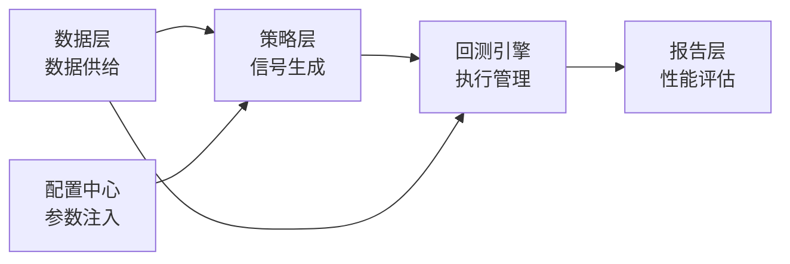
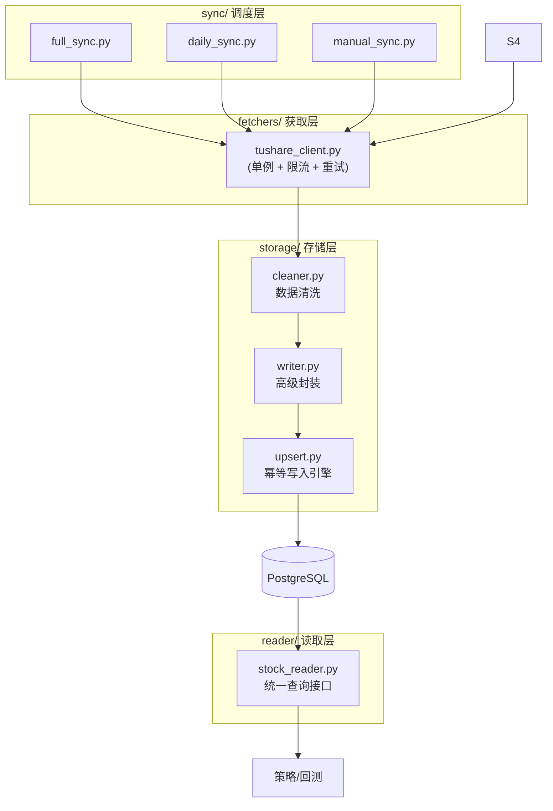
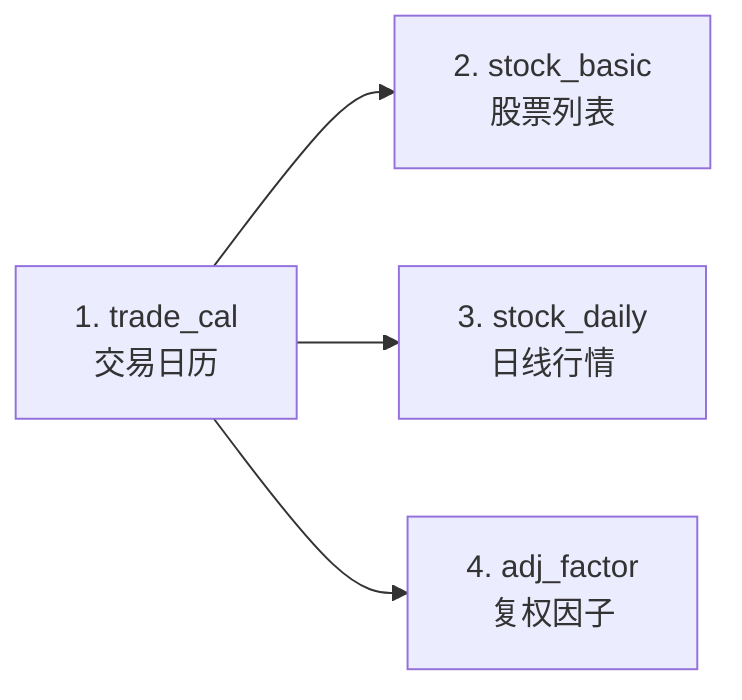
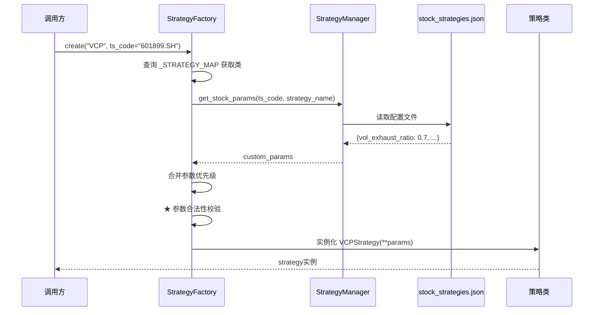
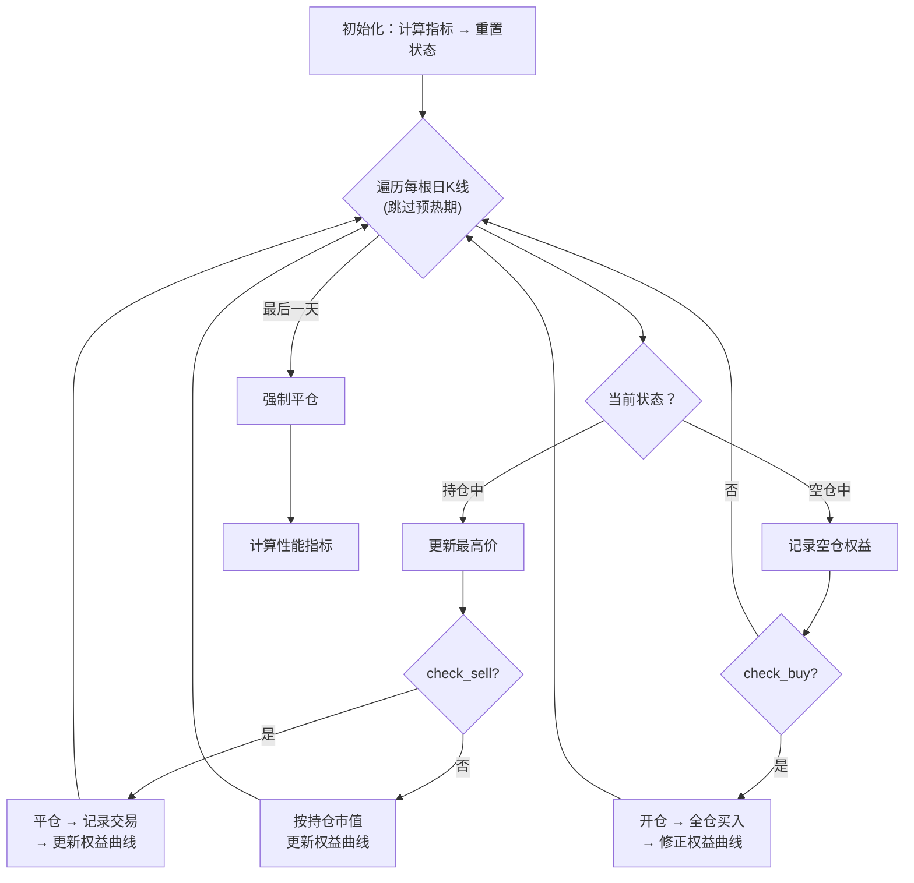
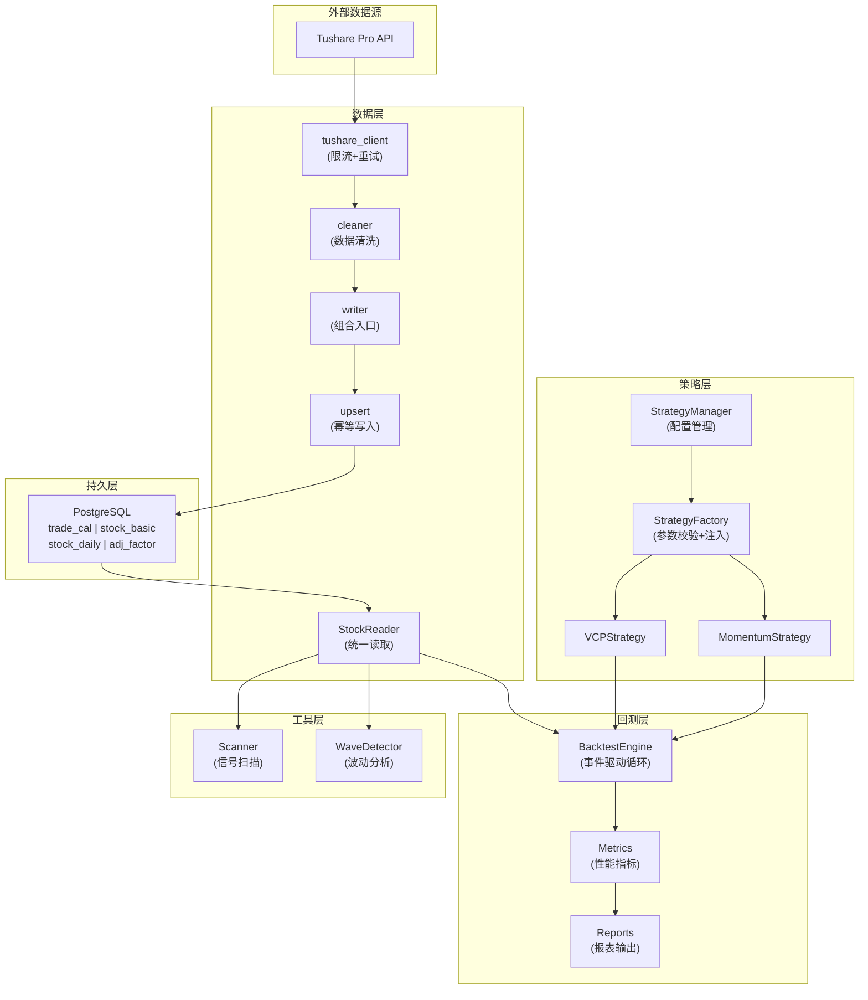

# VCP AKShare 量化交易平台 — 详细技术文档

> **版本**: 基于 2026-04-14 代码快照
> **定位**: 基于 Tushare + PostgreSQL 的本地化 A 股量化交易回测平台

---

## 目录

1. [系统总览](#1-系统总览)
2. [技术栈与依赖](#2-技术栈与依赖)
3. [项目目录结构](#3-项目目录结构)
4. [配置系统](#4-配置系统)
5. [数据库持久层](#5-数据库持久层)
6. [数据管理模块](#6-数据管理模块)
7. [策略体系](#7-策略体系)
8. [回测引擎](#8-回测引擎)
9. [分析工具模块](#9-分析工具模块)
10. [CLI 工具链与运行方式](#10-cli-工具链与运行方式)
11. [系统数据流全景图](#11-系统数据流全景图)
12. [核心设计原则](#12-核心设计原则)
13. [部署与运维指南](#13-部署与运维指南)

---

## 1. 系统总览

本平台是一个面向 A 股市场的**本地化量化交易研究系统**，核心能力包括：

| 能力 | 说明 |
|------|------|
| 📥 数据采集 | 通过 Tushare Pro API 获取日线行情、复权因子、交易日历等数据 |
| 🗄️ 本地存储 | PostgreSQL 数据库存储，支持幂等 Upsert，确保数据一致性 |
| 📈 策略研究 | 内置 VCP（波动收缩）和 Momentum（动量突破）两套完整策略 |
| ⚙️ 回测引擎 | 通用事件驱动引擎，支持信号与执行彻底解耦 |
| 🔍 信号扫描 | 全市场/多股策略扫描，实时检测买入信号 |
| 📊 波动分析 | 独立的波动检测器，用于技术形态研究 |

### 架构设计哲学

系统遵循 **"信号与执行分离"** 的核心设计原则：



- **策略层**只回答"该不该买/卖"
- **回测引擎**只处理"怎么买/卖"（资金、仓位、权益曲线）
- **数据层**只负责"提供什么数据"
- **配置中心**只管"用什么参数"

---

## 2. 技术栈与依赖

### 核心依赖

| 分类 | 库 | 版本要求 | 用途 |
|------|-----|---------|------|
| 环境配置 | `python-dotenv` | ≥ 1.0.0 | `.env` 环境变量加载 |
| 类型校验 | `pydantic` | ≥ 2.0.0 | 可选的配置管理增强 |
| 数据获取 | `tushare` | ≥ 1.2.89 | A 股数据 API |
| 数据分析 | `pandas` | ≥ 2.0.0 | DataFrame 核心 |
| 数值计算 | `numpy` | ≥ 1.24.0 | 矩阵/数值运算 |
| ORM 框架 | `SQLAlchemy` | ≥ 2.0.0 | 数据库 ORM |
| PG 驱动 | `psycopg2-binary` | ≥ 2.9.0 | PostgreSQL 同步驱动 |
| 数据库迁移 | `alembic` | ≥ 1.13.0 | Schema 版本管理 |
| 信号处理 | `scipy` | ≥ 1.15.0 | 波峰波谷检测 |
| 可视化 | `matplotlib` | ≥ 3.10.0 | 静态图表 |
| Web 仪表盘 | `dash` | ≥ 4.1.0 | 交互式分析面板 |
| 交互图表 | `plotly` | ≥ 6.6.0 | 动态图表渲染 |
| 扩展数据源 | `akshare` | ≥ 1.18.0 | 备用/扩展数据源 |

### Python 版本

代码使用了 Python 3.10+ 语法特性（如 `X | None` 类型注解、`match-case` 等），建议使用 **Python 3.10+**。

---

## 3. 项目目录结构

```text
vcp_akshare/
├── .env                        # 环境变量（数据库连接、Tushare Token）
├── .gitignore
├── alembic.ini                 # Alembic 数据库迁移配置
├── requirements.txt            # Python 依赖清单
│
├── configs/
│   └── stock_strategies.json   # 个股策略参数定制配置
│
├── docs/                       # 项目文档
│   ├── STRATEGY_GUIDE.md       # 策略配置与使用指南
│   ├── data_module_design.md   # 数据模块设计文档
│   ├── momentum_breakout_v2.md # 动量突破 v2.0 说明
│   ├── vcp_analysis_report.md  # VCP 分析报告示例
│   └── 数据库数据统计.md        # 数据库统计信息
│
├── backtest_results_vcp/       # VCP 回测结果输出目录
├── logs/                       # 运行日志目录
├── lab/                        # 实验性代码/笔记
├── scratch/                    # 临时脚本
│
└── src/                        # ★ 核心源码
    ├── main.py                 # 主入口（单股回测）
    ├── config/                 # 配置中心
    │   └── settings.py         # 全局设置（DB + Tushare）
    ├── database/               # 数据库持久层
    │   ├── session.py          # Session 工厂 + 连接池
    │   ├── models/             # ORM 模型
    │   │   ├── base.py         # 声明基类
    │   │   ├── trade_cal.py    # 交易日历表
    │   │   ├── stock_basic.py  # 股票基本信息表
    │   │   ├── stock_daily.py  # 日线行情表
    │   │   └── adj_factor.py   # 复权因子表
    │   └── migrations/         # Alembic 迁移脚本
    ├── data/                   # 数据管理模块
    │   ├── fetchers/           # 数据获取层
    │   │   └── tushare_client.py  # Tushare API 单例客户端
    │   ├── reader/             # 数据读取层
    │   │   └── stock_reader.py # 统一读取器
    │   ├── storage/            # 数据存储层
    │   │   ├── cleaner.py      # 数据清洗
    │   │   ├── upsert.py       # 幂等写入引擎
    │   │   └── writer.py       # 高级组合入口
    │   └── sync/               # 同步调度层
    │       ├── full_sync.py    # 基础数据 + 全量历史同步
    │       ├── daily_sync.py   # 每日增量同步
    │       └── manual_sync.py  # 手动同步
    ├── strategy/               # 策略模块
    │   ├── base.py             # 策略基类 + 数据结构定义
    │   ├── factory.py          # 策略工厂（参数校验+配置注入）
    │   ├── manager.py          # 配置文件管理器
    │   ├── vcp_strategy.py     # VCP 波动收缩策略
    │   └── momentum_breakout.py# 动量突破策略
    ├── backtest/               # 回测模块
    │   ├── engine/             # 回测引擎核心
    │   ├── metrics/            # 性能指标计算
    │   ├── reports/            # 报表输出
    │   ├── run_vcp_backtest.py # VCP 独立运行器
    │   └── run_momentum_breakout.py # 动量独立运行器
    ├── analysis/               # 分析工具
    │   ├── price_utils.py      # 价格数据预处理
    │   ├── wave_detector.py    # 波动检测器
    │   └── wave_report.py      # 波动分析报告
    └── tools/
        └── scanner.py          # 全市场策略扫描器
```

---

## 4. 配置系统

### 4.1 环境变量 (`.env`)

系统通过 `python-dotenv` 从根目录 `.env` 文件加载配置：

| 变量名 | 说明 | 示例 |
|--------|------|------|
| `DB_HOST` | PostgreSQL 主机地址 | `localhost` |
| `DB_PORT` | 数据库端口 | `5432` |
| `DB_USER` | 数据库用户名 | `postgres` |
| `DB_PASSWORD` | 数据库密码 | `mysecretpassword` |
| `DB_NAME` | 数据库名称 | `mydb` |
| `TUSHARE_TOKEN` | Tushare Pro API Token | `dfed7db4...` |
| `TUSHARE_HTTP_URL` | _(可选)_ 代理/Workers 地址 | `https://proxy.workers.dev` |

### 4.2 Settings 类

[settings.py](file:///Users/jiachuxiong/webProject/myProject/pythonProject/vcp_akshare/src/config/settings.py) 定义了两个 `@dataclass` 配置类：

```python
@dataclass
class DatabaseConfig:
    host, port, user, password, name
    @property database_url -> str  # 标准 PostgreSQL 连接字符串

@dataclass
class TushareConfig:
    token: str
    http_url: str  # 可选代理地址

@dataclass
class Settings:
    db: DatabaseConfig
    tushare: TushareConfig

settings = Settings()  # 全局单例
```

> [!TIP]
> 代理模式通过 "暴力注入" Tushare 客户端的私有属性 `_DataApi__http_url` 实现，如果 Tushare SDK 升级可能需要适配。

### 4.3 个股策略参数配置

[stock_strategies.json](file:///Users/jiachuxiong/webProject/myProject/pythonProject/vcp_akshare/configs/stock_strategies.json) 文件实现了**按个股定制化参数**功能：

```json
{
  "601899.SH": {
    "VCPStrategy": {
      "vol_exhaust_ratio": 0.7,
      "last_t_depth": 0.15,
      "setup_ready_days": 10
    },
    "MomentumBreakoutStrategy": {
      "min_pct_chg": 4.0
    }
  }
}
```

**参数优先级**（由高到低）：
1. 手动传入的 `kwargs`
2. JSON 配置文件中的参数
3. 策略类的默认参数

---

## 5. 数据库持久层

### 5.1 ORM 模型体系

所有模型继承自 `DeclarativeBase`，通过 Alembic 自动发现并管理 Schema 迁移。

#### 交易日历表 (`trade_cal`)

| 字段 | 类型 | 说明 |
|------|------|------|
| `exchange` ★ | String(10) | 交易所 (SSE/SZSE) |
| `cal_date` ★ | Date | 日历日期 |
| `is_open` | SmallInteger | 是否交易日：1=是，0=否 |
| `pretrade_date` | Date | 上一个交易日 |

> ★ = 联合主键

#### 股票基本信息表 (`stock_basic`)

| 字段 | 类型 | 说明 |
|------|------|------|
| `ts_code` ★ | String(12) | TS 代码，如 `000001.SZ` |
| `symbol` | String(10) | 纯数字代码 |
| `name` | String(50) | 股票名称 |
| `area` | String(30) | 地域（省市） |
| `industry` | String(50) | 所属行业（申万一级） |
| `market` | String(20) | 市场类型 |
| `exchange` | String(10) | 交易所 |
| `list_status` | String(1) | 上市状态 L/D/P |
| `list_date` | Date | 上市日期 |
| `delist_date` | Date | 退市日期 |
| `is_hs` | String(1) | 沪深港通标的 |
| `updated_at` | DateTime | 本地最后更新时间 |

#### 日线行情表 (`stock_daily`)

| 字段 | 类型 | 说明 |
|------|------|------|
| `ts_code` ★ | String(12) | TS 代码 |
| `trade_date` ★ | Date | 交易日期 |
| `open` | Numeric(12,4) | 开盘价 |
| `high` | Numeric(12,4) | 最高价 |
| `low` | Numeric(12,4) | 最低价 |
| `close` | Numeric(12,4) | 收盘价 |
| `pre_close` | Numeric(12,4) | 昨收价 |
| `change` | Numeric(12,4) | 涨跌额 |
| `pct_chg` | Numeric(10,4) | 涨跌幅(%) |
| `vol` | Numeric(20,2) | 成交量(手) |
| `amount` | Numeric(20,4) | 成交额(千元) |

**索引策略**:
- 主键联合索引 `(ts_code, trade_date)` — 精确查询
- `ix_stock_daily_ts_code` — 单股全历史（回测/策略）
- `ix_stock_daily_trade_date` — 单日全市场截面（选股/排名）

> [!IMPORTANT]
> 价格字段使用 `NUMERIC` 而非 `FLOAT`，避免浮点精度问题。这对金融数据至关重要。

#### 复权因子表 (`adj_factor`)

| 字段 | 类型 | 说明 |
|------|------|------|
| `ts_code` ★ | String(12) | TS 代码 |
| `trade_date` ★ | Date | 交易日期 |
| `adj_factor` | Numeric(20,6) | 复权因子（后复权基准） |

### 5.2 Session 管理

[session.py](file:///Users/jiachuxiong/webProject/myProject/pythonProject/vcp_akshare/src/database/session.py) 提供了两个核心工具：

**Engine（全局单例）**:
```python
_engine = create_engine(
    settings.db.database_url,
    pool_size=5,         # 常驻连接数
    max_overflow=10,     # 最大溢出连接
    pool_pre_ping=True,  # 自动探活
    echo=False,          # SQL 日志开关
)
```

**Session 上下文管理器**:
```python
@contextmanager
def get_session() -> Generator[Session, None, None]:
    session = _SessionLocal()
    try:
        yield session
        session.commit()    # 正常退出自动提交
    except Exception:
        session.rollback()  # 异常自动回滚
    finally:
        session.close()
```

关键配置:
- `autoflush=False` — 防止意外提前写库
- `expire_on_commit=False` — 提交后对象属性不失效

---

## 6. 数据管理模块

数据层采用 **四层架构**，各层职责完全隔离：



### 6.1 数据获取层 (`fetchers/`)

#### Tushare Client

[tushare_client.py](file:///Users/jiachuxiong/webProject/myProject/pythonProject/vcp_akshare/src/data/fetchers/tushare_client.py) — 单例 API 客户端，提供统一的查询入口。

**核心特性**:

| 特性 | 实现方式 |
|------|---------|
| 单例模式 | 模块级 `client = _TushareClient()` |
| 限流保护 | 每次调用后 `sleep(0.4s)` |
| 指数退避重试 | 失败后等待 2s → 4s → 8s，最多 3 次 |
| 代理支持 | 通过注入 `_DataApi__http_url` 实现 |

**统一调用方式**:
```python
from src.data.fetchers.tushare_client import client

df = client.query("daily", ts_code="000001.SZ", start_date="20240101")
df = client.query("stock_basic", list_status="L")
df = client.query("trade_cal", exchange="SSE", start_date="20240101")
df = client.query("adj_factor", ts_code="000001.SZ", start_date="20240101")
```

### 6.2 数据存储层 (`storage/`)

#### Cleaner — 数据清洗

[cleaner.py](file:///Users/jiachuxiong/webProject/myProject/pythonProject/vcp_akshare/src/data/storage/cleaner.py) 为每个 Tushare 接口提供专用清洗函数。

**通用清洗规则**:
1. 删除主键列为空的行（空主键无法 upsert）
2. 日期字段 `"YYYYMMDD"` → `datetime.date` 转换
3. 数值字段强制转 `float`，无法转换置 `None`
4. 字符串字段 strip 首尾空白
5. 删除全行重复

| 清洗函数 | 目标表 | 主键 |
|----------|--------|------|
| `clean_trade_cal()` | TradeCal | (exchange, cal_date) |
| `clean_stock_basic()` | StockBasic | ts_code |
| `clean_stock_daily()` | StockDaily | (ts_code, trade_date) |
| `clean_adj_factor()` | AdjFactor | (ts_code, trade_date) |

#### Upsert — 幂等写入引擎

[upsert.py](file:///Users/jiachuxiong/webProject/myProject/pythonProject/vcp_akshare/src/data/storage/upsert.py) 核心实现：

```python
def upsert_dataframe(session, model, df, conflict_columns, chunk_size=500) -> int
```

**关键机制**:
- 使用 PostgreSQL 原生 `INSERT ... ON CONFLICT DO UPDATE`
- 冲突时只更新**非主键列**
- 按 `chunk_size=500` 分批执行，避免 SQL 过长
- 自动将 `NaN/NaT` 转为 `None`
- 只保留 ORM 模型上实际存在的列

#### Writer — 高级组合入口

[writer.py](file:///Users/jiachuxiong/webProject/myProject/pythonProject/vcp_akshare/src/data/storage/writer.py) 将 `clean_xxx()` + `upsert_dataframe()` 组合为单次调用：

```python
write_trade_cal(session, df)     # 清洗 + 写入交易日历
write_stock_basic(session, df)   # 清洗 + 写入股票信息
write_stock_daily(session, df)   # 清洗 + 写入日线行情
write_adj_factor(session, df)    # 清洗 + 写入复权因子
```

### 6.3 数据读取层 (`reader/`)

#### StockReader — 统一查询接口

[stock_reader.py](file:///Users/jiachuxiong/webProject/myProject/pythonProject/vcp_akshare/src/data/reader/stock_reader.py) 是策略模块的**唯一数据入口**。

| 方法 | 参数 | 返回值 | 用途 |
|------|------|--------|------|
| `get_daily()` | ts_code, start, end | DataFrame | 原始日线（不复权） |
| `get_daily_adj()` | ts_code, start, end, mode | DataFrame | **[核心]** 复权日线 |
| `get_cross_section()` | trade_date, fields | DataFrame | 单日全市场截面 |
| `get_stock_list()` | list_status, exchange | DataFrame | 股票列表 |
| `get_trade_cal()` | start, end, exchange | DataFrame | 交易日历 |
| `is_trade_date()` | date, exchange | bool | 判断交易日 |
| `get_latest_date()` | ts_code | date | 本地最新日期 |
| `get_prev_trade_date()` | date, n | date | 前 N 个交易日 |
| `get_industry_info()` | ts_code | str | 查询行业 |
| `get_industry_performance()` | industry, date, window | float | 行业收益率 |

**复权价格计算原理**:

```python
# 后复权 (hfq): 以初始价格为基准
price_hfq = price × adj_factor

# 前复权 (qfq): 以最新价格为基准
price_qfq = price × adj_factor / latest_adj_factor
# 效果: 最新价格 = 原始价，历史价格按比例缩放
```

**ORM → DataFrame 转换**: 内置 `_orm_to_dataframe()` 方法，自动处理 `Decimal → float`、`None` 保持等细节。

### 6.4 同步调度层 (`sync/`)

#### 同步脚本概览

| 脚本 | 命令 | 用途 |
|------|------|------|
| [full_sync.py](file:///Users/jiachuxiong/webProject/myProject/pythonProject/vcp_akshare/src/data/sync/full_sync.py) | `python -m src.data.sync.full_sync --only cal` / `--only basic` / 全量执行 | 基础数据初始化与全量历史数据同步 |
| [daily_sync.py](file:///Users/jiachuxiong/webProject/myProject/pythonProject/vcp_akshare/src/data/sync/daily_sync.py) | `python -m src.data.sync.daily_sync` | 每日增量同步（收盘后运行） |
| [manual_sync.py](file:///Users/jiachuxiong/webProject/myProject/pythonProject/vcp_akshare/src/data/sync/manual_sync.py) | `python -m src.data.sync.manual_sync` | 单只股票/指数手动同步 |

#### 同步执行顺序（依赖关系）



> [!IMPORTANT]
> `trade_cal` 必须最先同步，因为日线和复权因子的增量同步依赖交易日历来确定需要补齐哪些日期。

#### 增量同步策略

`daily_sync.py` 实现了智能增量同步：

1. 查询本地各表最新日期 (`_get_latest_daily_date()`)
2. 从 `trade_cal` 获取需要补齐的交易日列表
3. 逐日拉取全市场数据 (`daily` 接口按交易日查询 ≈ 5000 行/天)
4. 利用 upsert 幂等特性，重复运行安全

**日志系统**: 增量同步同时输出到终端和 `logs/daily_sync.log` 文件。

---

## 7. 策略体系

### 7.1 策略基类 (`BaseStrategy`)

[base.py](file:///Users/jiachuxiong/webProject/myProject/pythonProject/vcp_akshare/src/strategy/base.py) 定义了策略层的完整类型系统和接口规范。

#### 核心数据结构

```python
@dataclass
class Signal:          # 交易信号
    date, signal_type, price, reason

@dataclass
class Trade:           # 单笔交易记录
    entry_date, entry_price, quantity, stop_loss_price,
    exit_date, exit_price, pnl, pnl_pct, exit_reason
    def close()        # 平仓计算损益

@dataclass
class Position:        # 持仓状态
    is_long, entry_date, entry_price, quantity,
    signal_low, highest_price

@dataclass
class BacktestResult:  # 回测结果
    trades, equity_curve, signals,
    total_return, annualized_return, win_rate,
    avg_win, avg_loss, profit_loss_ratio,
    max_drawdown, max_drawdown_pct, total_trades,
    winning_trades, losing_trades
```

#### 策略接口规范

| 方法 | 类型 | 说明 |
|------|------|------|
| `calculate_indicators(df)` | **必须实现** | 计算技术指标，返回添加指标列后的 DataFrame |
| `get_warmup_period()` | **必须实现** | 返回指标所需预热期长度（交易日数） |
| `check_buy(row, df, i)` | **必须实现** | 检查买入条件 → `(bool, price, reason)` |
| `check_sell(row, position)` | **必须实现** | 检查卖出条件 → `(bool, reason)` |
| `reset_state()` | 可选覆盖 | 重置策略内部状态 |
| `on_buy(date)` | 可选覆盖 | 买入后回调 |
| `on_sell(date)` | 可选覆盖 | 卖出后回调 |

**向后兼容**: 基类还提供了 `run(df)` 和 `print_report()` 方法，内部委托给 `BacktestEngine` 和 `reports` 模块。

### 7.2 VCP 波动收缩策略

[vcp_strategy.py](file:///Users/jiachuxiong/webProject/myProject/pythonProject/vcp_akshare/src/strategy/vcp_strategy.py) — 针对 A 股本地化的 VCP 策略。

#### 策略原理

VCP（Volatility Contraction Pattern）的核心思想：

```
          ┌──高点──┐
         /  T1: 大幅回调     ┌──┐
        /   (≤50%)          / T2: 收幅缩小  ┌─┐
───────/                   /   (≤15%)       / T3: 极度收缩
                          /                /   (≤8%) + 地量
                         /                /
                        └────────────────/──▶ 突破 Pivot = BUY
```

#### 买入条件（四重过滤）

| 过滤器 | 条件 | 说明 |
|--------|------|------|
| **Stage 2 趋势** | 价格 > MA200 > MA150 > MA120，MA50 > MA120，MA200 斜率 > 0 | Minervini 第二阶段上涨趋势 |
| **VCP 形态** | 距高点 < 25%，近 10 日波幅 < `last_t_depth`，地量确认 | 波动收缩 + 量能枯竭 |
| **突破确认** | 收盘价 > 近 20 日高点(Pivot)，成交量 > MA20 × 1.2 | 放量突破枢轴价 |
| **板块共振** _(可选)_ | 同行业平均涨幅 > `resonance_threshold` | 行业趋势共振 |

#### 卖出条件（三级止损）

| 止损类型 | 条件 | 说明 |
|----------|------|------|
| 硬止损 | 亏损 ≤ `hard_stop_loss` (-8%) | 不可逾越的最大亏损线 |
| 时间止损 | 持仓 `time_stop_days` 天后涨幅 < `min_profit_3d` (1%) | A 股特供：3 日不涨即撤 |
| 趋势止损 | 收盘价 < MA50 | 跌破趋势基准线 |

#### 完整参数列表

| 参数名 | 默认值 | 说明 |
|--------|--------|------|
| `ma_50` | 50 | 短期均线 |
| `ma_120` | 120 | 中期均线 |
| `ma_150` | 150 | 中长期均线 |
| `ma_200` | 200 | 长期均线（年线）|
| `contraction_window` | 120 | 形态溯源窗口 |
| `max_t1_depth` | 0.50 | 第一波最大回调深度 |
| `last_t_depth` | 0.08 | 最后一次波幅收缩要求 |
| `vol_exhaust_ratio` | 0.4 | 地量比率（成交量/近期高点） |
| `hard_stop_loss` | -8.0 | 硬止损(%) |
| `time_stop_days` | 3 | 时间止损天数 |
| `min_profit_3d` | 1.0 | 时间止损最小涨幅要求(%) |
| `setup_ready_days` | 5 | 形态就绪后等待窗口 |
| `resonance_threshold` | 1.5 | 板块共振阈值(%) |

#### 内部状态管理

VCP 策略维护了三个关键内部状态变量：

```python
self._days_in_trade = 0       # 持仓天数计数器
self._setup_ready_counter = 0 # 形态就绪后的倒计时
self._pending_pivot = None    # 等待突破的枢轴价
```

### 7.3 动量突破策略

[momentum_breakout.py](file:///Users/jiachuxiong/webProject/myProject/pythonProject/vcp_akshare/src/strategy/momentum_breakout.py) — 针对脉冲式爆发型股票设计。

#### 策略原理

```
空仓等待 ────▶ 大阳线(>5%) + 倍量突破 ────▶ 满仓入场
              价格 > MA60                     T+1 开盘价买入

持仓管理 ────▶ ATR 跟踪止盈 / 硬止损 / 跌破 MA20
```

#### 买入条件

| 条件 | 参数 | 默认值 |
|------|------|--------|
| 趋势向好 | 收盘价 > MA60 | `ma_long_period=60` |
| 大阳线 | 涨幅 > `min_pct_chg` | 5.0% |
| 倍量突破 | 成交量 > MA20 × `vol_multiplier` | 2.0 倍 |
| 乖离率限制 | `bias60` < `bias_threshold` | 0.25 |
| ATR 低波动 _(可选)_ | `atr_ratio` < `atr_threshold_ratio` | 0.5 |

**入场方式**: T+1 开盘价买入（通过 `get_buy_date()` 标记）

#### 卖出条件

| 止损/止盈机制 | 说明 |
|---------------|------|
| 跌破信号日低点 | `current_price < position.signal_low` |
| 硬止损 | 亏损 ≤ `hard_stop_loss` (-8%) |
| ATR 跟踪止盈 | `current_price < highest_price - atr_multiplier × ATR` |
| 跌破短期均线 | `close < MA20` |
| 财报规避 _(可选)_ | 财报日当天强制卖出 |

#### v2.0 优化特性

| 优化项 | 参数 | 说明 |
|--------|------|------|
| 防追高 | `bias_threshold=0.25` | 60 日乖离率过大时拒绝入场 |
| 吊灯止盈 | `use_trailing_stop=True, atr_multiplier=2.5` | 动态跟踪最高价，ATR 倍数回撤止盈 |
| 财报规避 | `avoid_earnings=False` | 临近财报日时不入场/强制平仓 |

### 7.4 策略工厂

[factory.py](file:///Users/jiachuxiong/webProject/myProject/pythonProject/vcp_akshare/src/strategy/factory.py) 实现了策略的统一创建入口：

```python
strategy = StrategyFactory.create("VCP", ts_code="601899.SH")
strategy = StrategyFactory.create("Momentum", ts_code="600089.SH")
```

**工厂工作流程**:



> [!WARNING]
> 工厂内置了**严格的参数校验**：如果配置文件中存在拼写错误的参数名，会立即抛出 `ValueError`，防止静默忽略。

**策略名称映射**:
| 别名 | 完整类名 |
|------|---------|
| `VCP` | `VCPStrategy` |
| `Momentum` | `MomentumBreakoutStrategy` |

---

## 8. 回测引擎

### 8.1 Engine — 核心执行循环

[engine/\_\_init\_\_.py](file:///Users/jiachuxiong/webProject/myProject/pythonProject/vcp_akshare/src/backtest/engine/__init__.py) 实现了通用的事件驱动回测核心。

```python
engine = BacktestEngine(initial_capital=1_000_000, debug=True)
result = engine.run(strategy, df, **kwargs)
```

#### 回测主循环流程



#### 关键设计细节

| 特性 | 实现 |
|------|------|
| 仓位管理 | `quantity = int(cash / buy_price / 100) * 100`（按手取整） |
| T+1 支持 | 如果策略实现了 `get_buy_date()`，买入日期取下一交易日 |
| 信号日低点 | 开仓时记录 `signal_low = row['low']`，供止损使用 |
| 最后一天 | 自动强制平仓，计入交易记录 |
| 权益曲线 | 每根 K 线更新一次 `(date, equity)` 元组 |

### 8.2 Metrics — 性能指标

[metrics/\_\_init\_\_.py](file:///Users/jiachuxiong/webProject/myProject/pythonProject/vcp_akshare/src/backtest/metrics/__init__.py) 计算标准化的回测评估指标：

| 指标 | 计算方式 |
|------|---------|
| 总收益率 | `(final_value - initial_capital) / initial_capital × 100` |
| 年化收益率 | `(final_value / initial_capital) ^ (1 / years) - 1` |
| 胜率 | `winning_trades / total_trades × 100` |
| 平均盈利 | `mean(winning trades PnL)` |
| 平均亏损 | `mean(losing trades PnL)` |
| 盈亏比 | `abs(avg_win / avg_loss)` |
| 最大回撤 | 权益曲线峰值到谷值的最大跌幅 |
| 最大回撤(%) | 最大回撤 / 峰值 × 100 |

### 8.3 Reports — 报表输出

[reports/\_\_init\_\_.py](file:///Users/jiachuxiong/webProject/myProject/pythonProject/vcp_akshare/src/backtest/reports/__init__.py) 输出标准化的终端报告：

```
======================================================================
  📊 Strategy Backtest Report: 601899.SH (VCP)
======================================================================

[ Performance Summary ]
  Final Equity:          1,234,567.00
  Total Return:          23.46%
  Annualized Return:     5.42%
  Max Drawdown:          89,012.00 (7.89%)

[ Trading Statistics ]
  Total Trades:          12
  Winning Trades:        7 (58.3%)
  Profit/Loss Ratio:     2.15
  Avg Win/Loss:          35,000 / -16,279

[ Trade Details ]
----------------------------------------------------------------------
Entry Date   Entry    Exit Date    Exit     PnL%     Reason
----------------------------------------------------------------------
2020-03-15    12.50   2020-04-02    14.20   +13.6%  触发ATR追踪止盈
...
----------------------------------------------------------------------
======================================================================
```

### 8.4 独立运行器

系统提供了两个策略的独立命令行运行器：

#### VCP 运行器

[run_vcp_backtest.py](file:///Users/jiachuxiong/webProject/myProject/pythonProject/vcp_akshare/src/backtest/run_vcp_backtest.py):

```bash
python -m src.backtest.run_vcp_backtest --stock 601899.SH --start 20200101 --end 20250401
```

**参数**:
| 参数 | 默认值 | 说明 |
|------|--------|------|
| `--stock` | `600089.SH` | 股票代码 |
| `--start` | `20200101` | 回测开始日期 |
| `--end` | `20250401` | 回测结束日期 |
| `--capital` | `1000000` | 初始资金 |
| `--depth` | None | 波幅收缩阈值覆盖 |
| `--vol-ratio` | None | 地量倍数覆盖 |
| `--output-dir` | `backtest_results_vcp` | 结果输出目录 |

**特殊处理**:
- 自动提前 1 年加载数据以确保均线预热
- 注入 `_reader` / `_industry` 以支持板块共振检测
- 自动导出交易明细 CSV

#### 动量运行器

[run_momentum_breakout.py](file:///Users/jiachuxiong/webProject/myProject/pythonProject/vcp_akshare/src/backtest/run_momentum_breakout.py):

```bash
python -m src.backtest.run_momentum_breakout --stock 600089.SH --start 20200101
```

支持所有 v2.0 参数的命令行配置（乖离率阈值、ATR 跟踪止盈等）。

---

## 9. 分析工具模块

### 9.1 价格预处理工具

[price_utils.py](file:///Users/jiachuxiong/webProject/myProject/pythonProject/vcp_akshare/src/analysis/price_utils.py):

```python
from src.analysis.price_utils import prepare_price_series

df = prepare_price_series(raw_df)
# 输出: DatetimeIndex, 时间正序, 新增 avg_price 列
```

### 9.2 波动检测器

[wave_detector.py](file:///Users/jiachuxiong/webProject/myProject/pythonProject/vcp_akshare/src/analysis/wave_detector.py) 基于 `scipy.signal.find_peaks` 实现波动检测：

#### 配置参数 (`WaveConfig`)

| 参数 | 默认值 | 说明 |
|------|--------|------|
| `signal_prominence_ratio` | 0.05 | 显著波动阈值(均价的 5%) |
| `noise_prominence_ratio` | 0.015 | 噪音波动最小显著性(1.5%) |
| `signal_min_distance` | 5 | 显著波峰/谷最小间隔(日) |
| `noise_min_distance` | 2 | 噪音波峰/谷最小间隔(日) |
| `noise_amplitude_min` | 1.5 | 噪音波幅下限(%) |
| `noise_amplitude_max` | 5.0 | 噪音波幅上限(%) |

#### 检测流程

```python
config = WaveConfig(signal_prominence_ratio=0.05)
detector = WaveDetector(config)
result: WaveResult = detector.detect(df)  # df 须含 avg_price 列
```

`WaveResult` 包含：
- `peaks` / `troughs` — 波峰/波谷位置索引
- `waves_df` — 显著波动明细表（阶段、起止日期、幅度、持续时间）
- `noise_df` — 噪音波动明细表

#### 关键算法: 交替极值过滤

`_find_alternating_extrema()` 确保检测出的峰谷序列中，峰和谷严格交替出现（避免连续出现两个波峰）。

### 9.3 波动分析报告

[wave_report.py](file:///Users/jiachuxiong/webProject/myProject/pythonProject/vcp_akshare/src/analysis/wave_report.py) 提供两种消费方式：

- `print_wave_summary(result)` — 终端 CLI 输出（人类可读）
- `get_wave_stats(result) -> dict` — 结构化字典（供 Dash/API 消费）

---

## 10. CLI 工具链与运行方式

### 10.1 全量启动流程

```bash
# Step 1: 安装依赖
uv venv .venv
source .venv/bin/activate
uv pip install -r requirements.txt

# Step 2: 配置环境变量
# 创建 .env，填入 DB 连接信息和 TUSHARE_TOKEN

# Step 3: 初始化数据库表结构
alembic upgrade head

# Step 4: 初始化基础数据（交易日历 + 股票列表）
python -m src.data.sync.full_sync --only cal
python -m src.data.sync.full_sync --only basic

# Step 5: 全量同步历史数据（首次需数小时）
python -m src.data.sync.full_sync --start 20200101

# Step 6: 运行回测
python -m src.main
```

### 10.2 日常运维

```bash
# 每日收盘后增量同步（建议 17:00+）
python -m src.data.sync.daily_sync

# 手动补同步某只股票
python -m src.data.sync.manual_sync
```

### 10.3 回测命令

```bash
# 通用入口
python -m src.main

# VCP 策略独立回测
python -m src.backtest.run_vcp_backtest --stock 601899.SH --start 20200101 --end 20250401

# 动量策略独立回测
python -m src.backtest.run_momentum_breakout --stock 600089.SH --start 20200101

# 全市场信号扫描
python -m src.tools.scanner --codes 600089.SH,601012.SH,601899.SH --strategy vcp
python -m src.tools.scanner --codes 600089.SH --strategy momentum
```

### 10.4 扫描器

[scanner.py](file:///Users/jiachuxiong/webProject/myProject/pythonProject/vcp_akshare/src/tools/scanner.py) 对给定股票列表检查最新一个交易日是否触发买入信号：

```
======================================================================
🔍 正在使用 [VCP] 策略扫描 3 只股票...
======================================================================

代码         | 最新日期     | 信号     | 价格     | 理由
--------------------------------------------------------------------------------
600089.SH    | 2026-04-11   | 🚀 BUY  |    15.20 | VCP突破; 符合VCP收缩
601012.SH    | 2026-04-11   | ⚪️ WAIT |    12.55 | 未触发信号
601899.SH    | 2026-04-11   | ⚪️ WAIT |     8.30 | 未触发信号
--------------------------------------------------------------------------------

✨ 扫描完成。
```

---

## 11. 系统数据流全景图



---

## 12. 核心设计原则

### 12.1 信号与执行分离

```
┌──────────────────────────────────────────────────────────────┐
│  策略只做信号判断            引擎只做交易执行               │
│                                                              │
│  check_buy()  ──┐           ┌── 资金管理                    │
│  check_sell() ──┼── 信号 ──▶├── 仓位计算（按手取整）        │
│  indicators  ──┘           ├── 权益曲线                    │
│                             └── 交易记录                    │
└──────────────────────────────────────────────────────────────┘
```

**好处**: 策略可以单独测试信号质量，引擎可以复用于任意策略。

### 12.2 幂等性

所有数据写入使用 `INSERT ON CONFLICT DO UPDATE`：
- 重复执行同一数据不报错
- 不产生重复行
- 支持断点续传

### 12.3 配置驱动

通过 JSON 配置文件实现参数定制，无需修改策略代码：

```json
{
  "601899.SH": {
    "VCPStrategy": { "vol_exhaust_ratio": 0.7 }
  }
}
```

### 12.4 分层解耦

| 层级 | 下游依赖 | 上游被依赖 |
|------|---------|-----------|
| config | 无 | 所有模块 |
| database | config | data.reader, data.storage |
| data.fetchers | config | data.sync |
| data.storage | database | data.sync |
| data.reader | database | strategy, backtest, tools |
| strategy | 无（纯信号逻辑） | backtest |
| backtest | strategy, data.reader | main, tools |
| tools | strategy, backtest, data.reader | 无 |

### 12.5 A 股本地化

| 特性 | 说明 |
|------|------|
| T+1 模拟 | 动量策略 T+1 开盘价入场 |
| 时间止损 | VCP 策略 3 日不涨即撤 |
| 按手取整 | 买入数量 = `int(cash / price / 100) * 100` |
| 板块共振 | VCP 可选行业涨幅过滤 |
| 财报规避 | 动量策略可选财报日前后规避 |

---

## 13. 部署与运维指南

### 13.1 环境要求

- **Python**: 3.10+
- **PostgreSQL**: 12+（需支持 `INSERT ON CONFLICT`）
- **Tushare 账号**: 120 分以上（全市场日线数据需要积分权限）

### 13.2 首次部署

```bash
# 1. 克隆代码并安装依赖
git clone <repo_url>
cd vcp_akshare
uv venv .venv
source .venv/bin/activate
uv pip install -r requirements.txt

# 2. 创建 PostgreSQL 数据库
createdb mydb

# 3. 配置环境变量
# 创建 .env，填入实际的 DB 连接信息和 TUSHARE_TOKEN

# 4. 初始化数据库表结构
alembic upgrade head

# 5. 同步基础数据
python -m src.data.sync.full_sync --only cal
python -m src.data.sync.full_sync --only basic

# 6. 同步历史行情（首次约需数小时）
python -m src.data.sync.full_sync --start 20200101
```

### 13.3 定时任务配置

建议使用 cron 在每个交易日收盘后自动运行增量同步：

```bash
# crontab -e
# 每个工作日 17:30 运行增量同步
30 17 * * 1-5 cd /path/to/vcp_akshare && python -m src.data.sync.daily_sync >> logs/cron.log 2>&1
```

### 13.4 代理模式

如果直接访问 Tushare API 有网络问题，可以配置 Cloudflare Workers 代理：

```env
TUSHARE_HTTP_URL=https://your-proxy-url.workers.dev
```

> [!CAUTION]
> 使用动态 IP 代理（如某些 Workers）可能触发 Tushare 的 **IP 数量超限** 限制。遇到该错误时，建议切换回直连模式或增加请求间隔。

### 13.5 故障排除

| 问题 | 解决方案 |
|------|---------|
| `TUSHARE_TOKEN 未配置` | 检查 `.env` 文件是否存在且 Token 正确 |
| 数据库连接失败 | 检查 PostgreSQL 是否启动，`.env` 中连接信息是否正确 |
| Tushare 频率限制 | 增大 `_CALL_INTERVAL`（默认 0.4s），或等待限制解除后重跑 |
| 数据不完整 | 利用幂等特性直接重跑 `daily_sync` 或 `full_sync` |
| 策略参数校验失败 | 检查 `configs/stock_strategies.json` 中的参数名是否拼写正确 |
| 回测无交易 | 检查数据日期范围是否覆盖，预热期是否足够 |

---

> **文档生成日期**: 2026-04-14 | **基于代码版本**: 当前 HEAD
