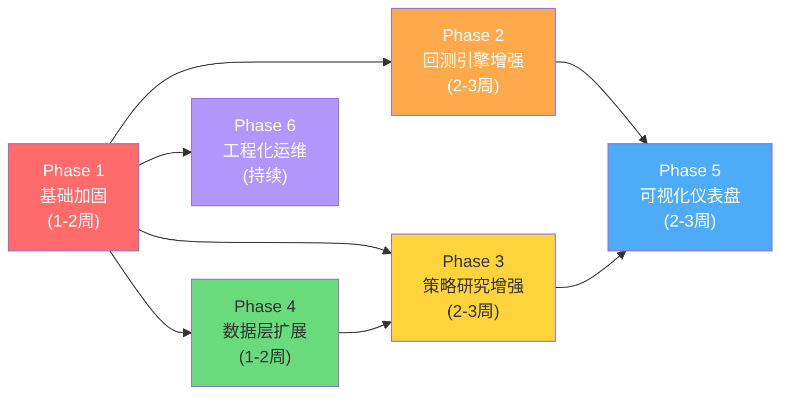

# VCP AKShare 代码与架构优化策略 + 后续开发计划

> 基于 2026-04-14 代码快照的全面审查结果

---

## 一、现有代码问题诊断

### 1.1 架构层面问题

#### 🔴 P0 — 策略依赖注入不规范

**现状**: VCP 策略的板块共振功能通过**直接操作私有属性**实现注入：

```python
# run_vcp_backtest.py 中的"注入"方式
strategy._reader = reader
strategy._ts_code = stock_code
strategy._industry = reader.get_industry_info(stock_code)
```

**问题**:
- 违反封装原则，外部代码直接写 `_` 前缀的内部属性
- 调用方必须知道策略内部实现细节
- 如果忘记注入，`_reader` 为 `None`，运行时不报错但共振过滤被静默跳过
- `BacktestEngine` 和 `Scanner` 都需要重复这段注入代码

#### 🔴 P0 — `sys.path` 硬编码 Hack

**现状**: 多个入口文件使用 `sys.path` hack 解决模块导入问题：

```python
# main.py
sys.path.append(os.getcwd())

# run_momentum_breakout.py
sys.path.insert(0, os.path.dirname(os.path.dirname(os.path.dirname(os.path.abspath(__file__)))))
```

**问题**:
- 依赖执行时的工作目录，不同环境下可能失败
- 两个文件用了不同的 hack 方式，不一致
- 正确做法是使用 `python -m` 或 `pyproject.toml` 配置

#### 🟡 P1 — 回测引擎功能缺失

| 缺失项 | 影响 |
|--------|------|
| 无滑点/手续费模型 | 回测收益偏乐观，不贴合实战 |
| 仅支持单标的 | 无法做组合回测 |
| 仅支持满仓 | 无法模拟分批建仓或仓位管理 |
| 无基准对比 | 无法评估策略是否跑赢大盘 |
| 无夏普/Sortino 比率 | 缺乏风险调整后收益指标 |

#### 🟡 P1 — 数据读取器效率问题

`StockReader._orm_to_dataframe()` 采用逐行遍历 + `getattr` 的方式转换：

```python
# 当前实现 - 逐行遍历，O(n × m) 次 getattr 调用
return pd.DataFrame([
    {col: _convert(getattr(r, col, None)) for col in columns}
    for r in rows
])
```

对于大数据集（全市场截面 ~5000 行），性能有优化空间。

#### 🟡 P1 — 缺少数据缓存机制

每次回测或扫描都从数据库重新查询完整数据。对于扫描器批量处理多只股票时，交易日历等公共数据被反复查询。

### 1.2 代码质量问题

#### 🟡 P1 — 无单元测试

整个项目没有任何测试文件。策略信号逻辑、指标计算、清洗函数、复权计算等核心模块都缺少测试覆盖。

#### 🟡 P1 — 日志使用不统一

- `main.py` 用 `print()` 输出
- `run_vcp_backtest.py` 用 `print()` 输出
- `BacktestEngine` 用 `logger.info()` 输出
- `scanner.py` 用 `print()` 输出

`print` 和 `logger` 混用导致在调整日志级别或重定向输出时行为不一致。

#### 🟢 P2 — 类型注解不完整

- `strategy/__init__.py` 为空文件，未导出公共 API
- 部分函数缺少返回值类型注解
- `scan_stocks()` 函数无返回值类型标注

#### 🟢 P2 — 配置文件无 Schema 校验

`stock_strategies.json` 没有 JSON Schema 或 Pydantic 模型验证。虽然 `StrategyFactory` 做了参数名校验，但缺少值域校验（如 `hard_stop_loss` 应为负数、`vol_exhaust_ratio` 应在 0~1 之间）。

#### 🟢 P2 — 重复代码

- `run_vcp_backtest.py` 和 `run_momentum_breakout.py` 中数据加载、报告打印、CSV 导出逻辑高度重复
- `full_sync.py` 和 `daily_sync.py` 中逐日拉取的循环模式重复

### 1.3 可维护性问题

| 问题 | 文件 | 说明 |
|------|------|------|
| `run_vcp_backtest.py` 注释重复 | L45 | `# 2. 通过工厂初始化策略` 出现两次 |
| `run_momentum_breakout.py` 默认 `end=20260101` | L28 | 硬编码未来日期，应动态计算 |
| `tushare_client.py` 全局初始化可能报错 | L103 | 模块级 `client = _TushareClient()` 在无 Token 时导入即崩溃 |
| `.env` 文件包含真实 Token | L9 | 安全隐患，应使用 `.env.example` |

---

## 二、优化策略方案

### 2.1 架构优化 — 依赖注入重构

**方案**: 引入 `StrategyContext` 上下文对象，取代私有属性直接注入。

```python
# 新增 strategy/context.py
@dataclass
class StrategyContext:
    """策略运行时上下文 — 由回测引擎/扫描器统一构建"""
    ts_code: str
    reader: Optional[StockReader] = None
    industry: Optional[str] = None
    # 未来可扩展: 板块指数数据、宏观指标等

# 修改 BaseStrategy 接口
class BaseStrategy(ABC):
    @abstractmethod
    def check_buy(self, row, df, i, ctx: StrategyContext = None, **kwargs):
        ...
```

**好处**: 
- 策略不再持有外部依赖的引用
- 上下文由引擎统一构建和传递
- 新增上下文字段不影响已有策略

### 2.2 架构优化 — 项目打包化

**方案**: 添加 `pyproject.toml` 替代 `sys.path` hack。

```toml
[project]
name = "vcp-akshare"
version = "1.0.0"
requires-python = ">=3.10"

[tool.setuptools.packages.find]
where = ["."]
include = ["src*"]
```

之后使用 `pip install -e .` 开发模式安装，所有模块导入问题自然解决。

### 2.3 引擎优化 — 交易成本模型

**方案**: 在 `BacktestEngine` 中引入可配置的成本模型。

```python
@dataclass
class CostModel:
    commission_rate: float = 0.0003    # 佣金费率 (万三)
    stamp_tax_rate: float = 0.001      # 印花税 (千一，仅卖出)
    slippage_pct: float = 0.001        # 滑点 (0.1%)
    min_commission: float = 5.0        # 最低佣金
```

### 2.4 引擎优化 — 基准与风险指标

**方案**: 在 `Metrics` 模块中扩展风险评估指标。

| 新增指标 | 说明 |
|----------|------|
| 夏普比率 | `(年化收益 - 无风险利率) / 收益波动率` |
| Sortino 比率 | 只考虑下行波动的风险调整收益 |
| Calmar 比率 | `年化收益 / 最大回撤` |
| 基准超额收益 | 策略收益 vs 沪深300 |
| 月度收益分布 | 按月统计胜率和收益 |

### 2.5 数据层优化 — 查询缓存

**方案**: 为 `StockReader` 添加 LRU 缓存层（基于 `functools.lru_cache` 或简单 dict 缓存）。

```python
class StockReader:
    def __init__(self):
        self._cache = {}
    
    def get_daily_adj(self, ts_code, start_date, end_date, mode="qfq"):
        cache_key = (ts_code, start_date, end_date, mode)
        if cache_key not in self._cache:
            self._cache[cache_key] = self._query_db(...)
        return self._cache[cache_key].copy()
```

### 2.6 数据层优化 — ORM 转换加速

**方案**: 使用 SQLAlchemy `Result.mappings()` 或 `pandas.read_sql()` 替代逐行 `getattr`。

```python
# 优化后
@staticmethod
def _orm_to_dataframe(session, query, columns):
    return pd.read_sql(query.statement, session.bind, columns=columns)
```

### 2.7 代码质量 — 统一日志

**方案**: 全局替换 `print()` 为 `logger`，并在入口统一配置日志格式。

```python
# src/utils/logging.py
def setup_logging(level=logging.INFO, log_file=None):
    """统一日志配置，支持终端 + 文件双输出"""
    ...
```

### 2.8 代码质量 — 运行器去重

**方案**: 提取通用回测运行器基类。

```python
# src/backtest/runner.py
class BacktestRunner:
    """通用回测运行器 — 提供数据加载、参数打印、报告输出、CSV 导出等通用逻辑"""
    def load_data(self, stock_code, start, end) -> pd.DataFrame: ...
    def print_params(self, strategy): ...
    def run_and_report(self, strategy, df, stock_code) -> BacktestResult: ...
    def export_csv(self, result, output_dir, stock_code): ...
```

### 2.9 安全性 — Token 保护

**方案**:
1. 将 `.env` 加入 `.gitignore`（当前已加入）
2. 提供 `.env.example` 模板（不含真实 Token）
3. `tushare_client.py` 改为懒初始化，避免导入时崩溃

```python
# 改为懒初始化
class _TushareClient:
    _instance = None
    
    @classmethod
    def get_instance(cls):
        if cls._instance is None:
            cls._instance = cls()
        return cls._instance

# 模块级 property
def _get_client():
    return _TushareClient.get_instance()
```

---

## 三、后续开发计划

### Phase 1: 基础加固（1-2 周）

> 目标：夯实代码质量，建立可持续开发基础

| 优先级 | 任务 | 预计工时 |
|--------|------|---------|
| 🔴 P0 | 添加 `pyproject.toml`，移除所有 `sys.path` hack | 2h |
| 🔴 P0 | 重构策略依赖注入：引入 `StrategyContext` | 4h |
| 🔴 P0 | Tushare Client 改为懒初始化 | 1h |
| 🟡 P1 | 创建 `.env.example` 模板，清理 `.env` 中的敏感信息 | 0.5h |
| 🟡 P1 | 全局 `print()` → `logger` 统一化 | 2h |
| 🟡 P1 | 核心单元测试搭建（pytest + conftest） | 4h |
| 🟡 P1 | 策略信号逻辑测试（VCP check_buy/sell 边界 case） | 4h |
| 🟡 P1 | 数据清洗函数测试（cleaner 各函数） | 2h |
| 🟡 P1 | 复权计算测试（qfq/hfq 数值正确性） | 2h |

**Phase 1 交付物**:
- 所有入口文件可通过 `python -m` 正常运行，无需 `sys.path` hack
- 核心模块测试覆盖率 > 60%
- `StrategyContext` 注入模式就位

---

### Phase 2: 回测引擎增强（2-3 周）

> 目标：让回测结果更贴近实战，支持更丰富的评估维度

| 优先级 | 任务 | 预计工时 |
|--------|------|---------|
| 🔴 P0 | 交易成本模型（佣金 + 印花税 + 滑点） | 4h |
| 🔴 P0 | 风险指标扩展（夏普/Sortino/Calmar） | 4h |
| 🟡 P1 | 基准对比（策略 vs 沪深300，超额收益） | 6h |
| 🟡 P1 | 月度/年度收益分布统计 | 3h |
| 🟡 P1 | 通用回测运行器（去除 run_xxx 重复代码） | 4h |
| 🟢 P2 | 持仓天数统计 + 资金利用率指标 | 2h |
| 🟢 P2 | 回测结果可视化（matplotlib 权益曲线图） | 4h |

**Phase 2 交付物**:
- 回测报告包含夏普比率、Sortino、最大回撤持续天数等风险指标
- 交易成本从虚拟的 `0` 优化为符合 A 股实际的费率模型
- 输出 vs 沪深300 基准的超额收益对比图

---

### Phase 3: 策略研究增强（2-3 周）

> 目标：提升策略研究效率，支持参数调优和多策略对比

| 优先级 | 任务 | 预计工时 |
|--------|------|---------|
| 🟡 P1 | 参数网格搜索（Grid Search） | 8h |
| 🟡 P1 | Walk-Forward 滚动验证框架 | 6h |
| 🟡 P1 | 多策略对比报告（同期回测结果并排） | 4h |
| 🟡 P1 | 策略参数 Pydantic Schema 校验 | 3h |
| 🟢 P2 | 信号质量分析（各过滤器命中率统计） | 4h |
| 🟢 P2 | 支持自定义仓位管理（分批建仓/金字塔加仓） | 6h |
| 🟢 P2 | 新增策略模板：均线金叉/突破通道/MACD 背离 | 8h |

**Phase 3 交付物**:
- 支持 `python -m src.tools.optimizer --strategy VCP --param vol_exhaust_ratio:0.3:0.8:0.1` 式的参数优化
- Walk-Forward 验证报告，评估策略在不同市场周期的稳健性
- Pydantic 值域校验（如 `hard_stop_loss` 必须为负数）

---

### Phase 4: 数据层扩展（1-2 周）

> 目标：丰富数据维度，提升查询性能

| 优先级 | 任务 | 预计工时 |
|--------|------|---------|
| 🟡 P1 | StockReader 查询缓存层 | 3h |
| 🟡 P1 | ORM 转 DataFrame 性能优化 | 2h |
| 🟡 P1 | 新增数据表：板块指数日线 | 4h |
| 🟢 P2 | 新增数据表：财务指标（PE/PB/ROE） | 6h |
| 🟢 P2 | 新增数据表：龙虎榜/大单资金流 | 4h |
| 🟢 P2 | 数据质量监控（缺失日期检测+自动补齐） | 4h |

**Phase 4 交付物**:
- 扫描器性能提升 30%+（缓存命中后不再重复查库）
- 板块共振过滤使用真实的板块指数数据（取代当前的行业平均涨幅近似）
- 数据健康报告：自动检测并补齐缺失交易日的数据

---

### Phase 5: 可视化与仪表盘（2-3 周）

> 目标：构建交互式分析面板（利用已安装的 Dash + Plotly）

| 优先级 | 任务 | 预计工时 |
|--------|------|---------|
| 🟡 P1 | Dash Web 仪表盘骨架搭建 | 4h |
| 🟡 P1 | K 线图 + 买卖信号标注 | 6h |
| 🟡 P1 | 权益曲线 + 回撤区间可视化 | 4h |
| 🟢 P2 | 参数调优面板（滑块调参 → 实时回测） | 8h |
| 🟢 P2 | 多股扫描结果看板 | 4h |
| 🟢 P2 | 波动分析交互图表 | 4h |

**Phase 5 交付物**:
- `python -m src.dashboard` 启动本地 Web 面板
- 交互式 K 线图标注所有买卖信号点
- 实时拖动参数滑块，立即看到回测结果变化

---

### Phase 6: 工程化与运维（持续）

> 目标：建立可靠的开发与运维流程

| 优先级 | 任务 | 预计工时 |
|--------|------|---------|
| 🟡 P1 | Docker Compose（PostgreSQL + 应用） | 3h |
| 🟡 P1 | GitHub Actions CI（lint + test） | 2h |
| 🟢 P2 | pre-commit hooks（black + ruff + mypy） | 1h |
| 🟢 P2 | 增量同步通知（微信/钉钉 Webhook） | 3h |
| 🟢 P2 | 信号告警推送（VCP 突破时发通知） | 4h |
| 🟢 P2 | 异步数据同步（asyncpg + async Tushare） | 8h |

---

## 四、各阶段依赖关系



> [!IMPORTANT]
> **Phase 1 是所有后续阶段的前置条件**。建议优先完成基础加固，否则后续开发会在不稳固的地基上堆砌。

---

## 五、优化优先级总览

### 🔥 立即修复（Phase 1 首批）

| # | 问题 | 修复方案 | 复杂度 |
|---|------|---------|--------|
| 1 | `sys.path` hack | `pyproject.toml` + `pip install -e .` | ⭐ |
| 2 | 私有属性注入 | `StrategyContext` 上下文对象 | ⭐⭐ |
| 3 | Tushare 导入即崩溃 | 懒初始化单例 | ⭐ |
| 4 | `.env` 含真实 Token | 创建 `.env.example`，gitignore 验证 | ⭐ |

### 📈 高价值优化（Phase 2-3 核心）

| # | 优化项 | 价值 | 复杂度 |
|---|--------|------|--------|
| 5 | 交易成本模型 | 回测结果显著更准确 | ⭐⭐ |
| 6 | 风险指标扩展 | 策略评估更专业 | ⭐⭐ |
| 7 | 参数网格搜索 | 研究效率提升 10x | ⭐⭐⭐ |
| 8 | Walk-Forward 验证 | 避免过拟合 | ⭐⭐⭐ |
| 9 | 单元测试体系 | 长期可维护性基础 | ⭐⭐ |

### 🌟 远期愿景

| # | 方向 | 说明 |
|---|------|------|
| 10 | 多标的组合回测 | 从个股到投资组合 |
| 11 | 实盘对接 | 模拟盘/实盘 API 接入 |
| 12 | ML 因子挖掘 | 机器学习辅助特征选择 |
| 13 | 分布式回测 | Celery/Ray 并行多参数组合 |

---

## 六、技术债务清单

以下是需要逐步偿还的技术债务，按修复成本排序：

| 技术债 | 所在文件 | 修复成本 | 风险等级 |
|--------|---------|---------|---------|
| `sys.path.append(os.getcwd())` | `main.py` | 低 | 🔴 |
| `sys.path.insert(0, ...)` | `run_momentum_breakout.py` | 低 | 🔴 |
| `strategy._reader = reader` 直接注入 | `run_vcp_backtest.py` | 中 | 🔴 |
| 模块级 `client = _TushareClient()` | `tushare_client.py` | 低 | 🟡 |
| 注释重复 `# 2. 通过工厂初始化策略` | `run_vcp_backtest.py:L45` | 极低 | 🟢 |
| 硬编码 `end_date="20260101"` | `run_momentum_breakout.py:L28` | 极低 | 🟢 |
| `print()` 与 `logger` 混用 | 多个文件 | 中 | 🟡 |
| 两个 runner 大量重复代码 | `run_*_backtest.py` | 中 | 🟡 |
| `utils/__init__.py` 空目录无功能 | `src/utils/` | 低 | 🟢 |
| `strategy/__init__.py` 无公共导出 | `src/strategy/__init__.py` | 低 | 🟢 |
| 无 `py.typed` marker | 项目级 | 低 | 🟢 |
