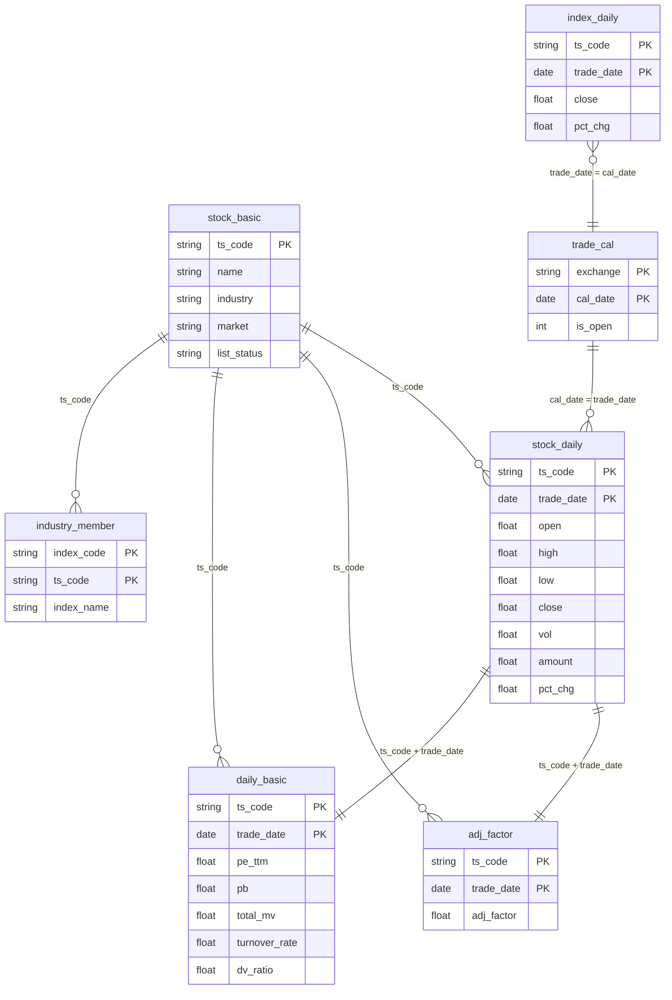

# 📊 数据库可分析能力全景图

> **生成时间**: 2026-04-16  
> **数据库**: 本地 PostgreSQL

---

## 一、当前数据资产概览

| # | 数据表 | 记录数 | 覆盖标的 | 日期范围 | 用途关键词 |
|---|--------|--------|----------|----------|------------|
| 1 | `stock_basic` | 5,828 | 5,505 上市 / 323 退市 | — | 股票元数据、行业、市场 |
| 2 | `stock_daily` | 540 万 | 5,678 只 | 2010-01 ~ 2026-04-15 | OHLCV、涨跌幅 |
| 3 | `adj_factor` | 548 万 | 5,691 只 | 2010-01 ~ 2026-04-16 | 前/后复权价计算 |
| 4 | `daily_basic` | 422 万 | 5,634 只 | 2023-01 ~ 2026-04-15 | PE/PB/市值/换手率 |
| 5 | `index_daily` | 6,344 | 8 个指数 | 2023-01 ~ 2026-04-15 | 大盘基准、策略对标 |
| 6 | `industry_member` | 6,292 | 24 个行业 / 5,105 只股 | — | 申万行业成分股映射 |
| 7 | `trade_cal` | 25,607 | SSE/SZSE | 1990-12 ~ 2026-04-16 | 交易日判断 |

### 覆盖的 8 个指数

| 代码 | 名称 |
|------|------|
| 000001.SH | 上证指数 |
| 000300.SH | 沪深300 |
| 000688.SH | 科创50 |
| 000852.SH | 中证1000 |
| 000905.SH | 中证500 |
| 399001.SZ | 深证成指 |
| 399006.SZ | 创业板指 |
| 399673.SZ | 创业板50 |

### 市场分布（上市股）

| 板块 | 数量 |
|------|------|
| 主板 | 3,195 |
| 创业板 | 1,396 |
| 科创板 | 607 |
| 北交所 | 307 |

---

## 二、可执行分析分类

### 🔴 第一类：个股技术分析（单票时间序列）

> 所需表：`stock_daily` + `adj_factor`

| 分析项 | 说明 | 涉及字段 |
|--------|------|----------|
| **复权价格序列** | 前/后复权，消除除权缺口 | close × adj_factor |
| **均线系统** | MA5/10/20/50/120/150/200 | close (复权) |
| **K线形态识别** | 十字星、锤子线、吞没形态等 | open, high, low, close |
| **波动检测 (已实现)** | 显著波动 & 噪音波动 | avg_price (派生) |
| **成交量分析** | 量价关系、缩量/放量判断、地量检测 | vol, amount |
| **涨跌幅统计** | 日/周/月收益率分布、最大回撤 | pct_chg, close |
| **波动率计算** | 历史波动率 (HV)、ATR | high, low, close |
| **趋势强度指标** | RSI、MACD、布林带、KDJ | close, high, low |
| **Stage 分析 (已实现)** | Minervini 第二阶段趋势判断 | close + 多条均线 |
| **VCP 形态检测 (已实现)** | 波幅收缩 + 地量确认 | high, low, close, vol |

---

### 🟠 第二类：全市场截面扫描（选股 / 排名）

> 所需表：`stock_daily` + `daily_basic` + `stock_basic`

| 分析项 | 说明 | 涉及字段 |
|--------|------|----------|
| **涨幅排行榜** | 当日/周/月涨幅 Top N | pct_chg |
| **放量突破选股** | 成交量倍率 + 价格创新高 | vol, vol_ma, high |
| **动量选股** | N 日收益率排名，动量因子 | close (复权) |
| **VCP 全市场扫描** | 批量检测 VCP 形态就绪的股票 | 策略指标组合 |
| **新高/新低统计** | 创 52 周新高/新低的股票数量 | high, low |
| **均线多头排列筛选** | MA50 > MA120 > MA150 > MA200 | close (复权) |
| **成交额集中度** | 全市场成交额前 N% 的股票 | amount |
| **涨停/跌停统计** | 涨跌幅 ≥ 9.9% / ≤ -9.9% 的股票 | pct_chg |

---

### 🟡 第三类：行业 / 板块分析

> 所需表：`industry_member` + `stock_daily` + `index_daily` + `stock_basic`

| 分析项 | 说明 | 涉及字段/表 |
|--------|------|-------------|
| **行业轮动分析** | 各行业指数的月/季度涨跌幅排列 | index_daily (行业指数) 或 stock_daily 按行业聚合 |
| **板块强度评分** | 行业内个股涨幅中位数、上涨占比 | industry_member JOIN stock_daily |
| **板块共振检测 (已实现)** | VCP 策略的行业共振过滤条件 | industry_member + 行业均涨幅 |
| **行业成分股清单** | 查看某行业下所有个股 | industry_member |
| **跨板块对比** | 主板 vs 创业板 vs 科创板表现 | stock_basic.market + stock_daily |
| **行业资金流向** | 行业内总成交额变化趋势 | industry_member JOIN stock_daily.amount |
| **龙头股筛选** | 行业内涨幅/市值/成交额前 N | 多表联合 |

---

### 🟢 第四类：基本面 & 估值分析

> 所需表：`daily_basic` + `stock_basic`

| 分析项 | 说明 | 涉及字段 |
|--------|------|----------|
| **估值分位数** | 个股/行业 PE、PB 历史百分位 | pe, pe_ttm, pb |
| **低估值选股** | PE < 行业中位数 & PB < 2 | pe, pb |
| **高股息筛选** | 股息率 Top N | dv_ratio, dv_ttm |
| **市值分层分析** | 大盘股 vs 中盘 vs 小盘表现 | total_mv, circ_mv |
| **换手率异动** | 换手率突然放大（可能预示变盘） | turnover_rate, turnover_rate_f |
| **量比选股** | 量比 > 2 的活跃股 | volume_ratio |
| **市销率分析** | 适用于高成长不盈利公司 | ps, ps_ttm |
| **自由流通占比** | 筹码集中度参考 | free_share / total_share |
| **小市值效应研究** | 按市值分组统计收益率差异 | total_mv + pct_chg |

---

### 🔵 第五类：策略回测 & 组合分析

> 所需表：全部表联合使用

| 分析项 | 说明 | 已实现？ |
|--------|------|----------|
| **VCP 策略回测** | 波动收缩 + 地量 + 均线多头 | ✅ 已实现 (事件驱动 + VectorBT) |
| **动量突破回测** | 放量涨停突破 + ATR 追踪止盈 | ✅ 已实现 |
| **参数网格优化** | VectorBT 参数扫描 | ✅ 已实现 |
| **策略 vs 基准对比** | 策略净值 vs 沪深300/上证指数 | ✅ 可用 index_daily |
| **多股票批量回测** | 对 5000+ 股票批量跑策略 | 🔧 可实现 |
| **行业中性策略** | 按行业对冲，消除行业 beta | 🔧 可实现 |
| **因子分析** | 构建多因子模型（动量 + 估值 + 质量） | 🔧 可实现 |
| **组合优化** | 等权/市值加权/风险平价组合 | 🔧 可实现 |
| **风险指标分析** | Sharpe、Sortino、Calmar、最大回撤 | ✅ VectorBT 内置 |

---

## 三、高价值分析场景推荐（优先级排序）

### ⭐⭐⭐ 最高优先级 — 直接可用

| 序号 | 场景 | 描述 | 预计工作量 |
|------|------|------|------------|
| 1 | **全市场 VCP 扫描** | 每日扫描 5000+ 股票，输出 VCP 形态就绪清单 | 小（已有 VCP 逻辑，需加批量循环） |
| 2 | **行业轮动看板** | 24 个申万行业的周/月涨跌幅排列 + 资金流向 | 小 |
| 3 | **估值分位数监控** | 个股/行业 PE/PB 所处历史百分位 | 小 |
| 4 | **大盘情绪指标** | 涨停数/跌停数、新高新低比、成交额热度 | 小 |

### ⭐⭐ 高优先级 — 需少量开发

| 序号 | 场景 | 描述 | 预计工作量 |
|------|------|------|------------|
| 5 | **多因子选股** | 动量 + 估值 + 换手率组合打分 | 中 |
| 6 | **策略组合管理** | 多策略多标的的组合净值跟踪 | 中 |
| 7 | **板块联动分析** | 行业间相关性、板块轮动节奏挖掘 | 中 |

### ⭐ 值得扩展 — 需新增数据

| 序号 | 场景 | 缺少数据 | 建议 |
|------|------|----------|------|
| 8 | 财务报表分析 | 利润表/资产负债表 | 新增 `income` / `balancesheet` 表 |
| 9 | 资金流向分析 | 主力资金数据 | 新增 `moneyflow` 表 |
| 10 | 龙虎榜分析 | 龙虎榜明细 | 新增 `top_list` 表 |
| 11 | 分钟级策略 | 分钟K线数据 | 新增 `stock_min` 表 |

---

## 四、表关联关系图



---

## 五、典型 SQL 查询示例

### 1. 某日涨幅 Top 10（带行业信息）
```sql
SELECT sd.ts_code, sb.name, sb.industry, sd.pct_chg, sd.vol, sd.amount
FROM stock_daily sd
JOIN stock_basic sb ON sd.ts_code = sb.ts_code
WHERE sd.trade_date = '2026-04-15'
ORDER BY sd.pct_chg DESC
LIMIT 10;
```

### 2. 行业月度涨幅排名
```sql
WITH industry_returns AS (
    SELECT sb.industry,
           AVG(sd.pct_chg) AS avg_daily_return,
           COUNT(DISTINCT sd.ts_code) AS stock_count
    FROM stock_daily sd
    JOIN stock_basic sb ON sd.ts_code = sb.ts_code
    WHERE sd.trade_date >= '2026-03-15'
    GROUP BY sb.industry
)
SELECT * FROM industry_returns ORDER BY avg_daily_return DESC;
```

### 3. 低估值 + 高股息选股
```sql
SELECT db.ts_code, sb.name, sb.industry,
       db.pe_ttm, db.pb, db.dv_ttm, db.total_mv / 10000 AS total_mv_yi
FROM daily_basic db
JOIN stock_basic sb ON db.ts_code = sb.ts_code
WHERE db.trade_date = '2026-04-15'
  AND db.pe_ttm BETWEEN 5 AND 20
  AND db.pb < 2
  AND db.dv_ttm > 3
  AND sb.list_status = 'L'
ORDER BY db.dv_ttm DESC;
```

### 4. 市场情绪指标（涨停数 / 跌停数）
```sql
SELECT trade_date,
       COUNT(*) FILTER (WHERE pct_chg >= 9.9)  AS limit_up,
       COUNT(*) FILTER (WHERE pct_chg <= -9.9) AS limit_down,
       COUNT(*) FILTER (WHERE pct_chg > 0)     AS up_count,
       COUNT(*) FILTER (WHERE pct_chg < 0)     AS down_count
FROM stock_daily
WHERE trade_date >= '2026-04-01'
GROUP BY trade_date
ORDER BY trade_date;
```

### 5. 策略收益 vs 沪深300 基准
```sql
SELECT sd.trade_date, sd.close AS stock_close, id.close AS hs300_close
FROM stock_daily sd
JOIN index_daily id ON sd.trade_date = id.trade_date
WHERE sd.ts_code = '600089.SH'
  AND id.ts_code = '000300.SH'
  AND sd.trade_date >= '2023-01-01'
ORDER BY sd.trade_date;
```
